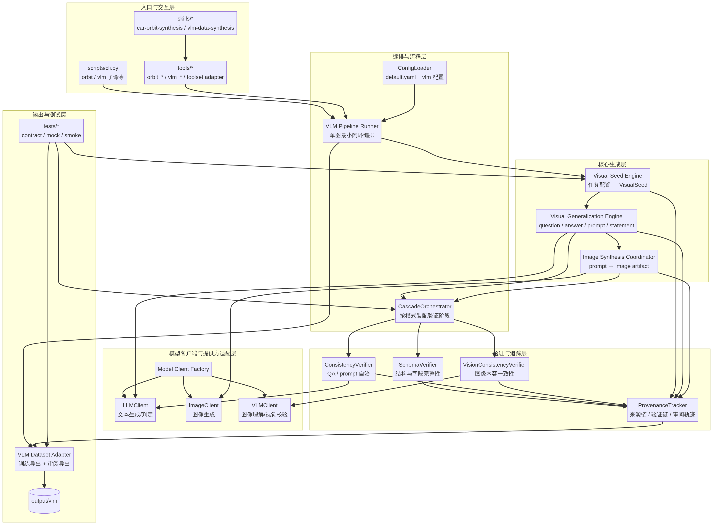

# ARCHITECTURE.md

**项目名称：** VLM-data-agent（基于 Hermes-data-agent 演进）  
**阶段：** 第2阶段——架构与设计  
**日期：** 2026-04-14  
**作者：** Manus AI

## 高层架构



VLM-data-agent 的目标不是在现有文本 ORBIT 流水线外再外挂一条图像脚本，而是在 **Hermes-data-agent 现有“入口层—工具层—核心引擎层—适配层”骨架** 上，演进出一条可持续维护的多模态数据合成主链路。基于第1阶段已确认的范围，本阶段将系统目标收敛为 **单图最小闭环**：系统需要能够从视觉任务配置生成单图问答候选样本，完成结构校验、自洽校验与图像一致性校验，并将结果分别导出为训练数据和审阅数据。

为保证改造过程不破坏已有文本 ORBIT 能力，本架构采用 **双轨共存、共享基础设施、模式化编排** 的设计原则。也就是说，文本 ORBIT 与视觉 VLM 不共享业务对象本身，但共享配置加载、追踪、CLI 入口、工具注册与部分编排机制。视觉链路新增的数据契约、客户端抽象与验证阶段，将以新增模块或受控扩展的形式落入现有仓库，而不是通过修改单个大脚本实现功能堆叠。

从分层视角看，目标系统可以概括为六层：**入口与交互层、编排与流程层、核心生成层、验证与追踪层、模型客户端与提供方适配层、输出与测试层**。其中，最关键的变化不是“多了图像生成”本身，而是系统开始围绕 `VLMSample` 这一中间对象组织数据流，使“问题—答案—图像提示词—图像产物—验证轨迹—导出结果”形成完整生命周期。

## 模块职责

| 模块 | 主要职责 | 技术选型 | 依赖关系 |
| --- | --- | --- | --- |
| **CLI 入口**（`scripts/cli.py`） | 保留现有 `orbit` 入口，同时新增 `vlm` 子命令，负责参数解析、模式选择、运行目录创建与摘要输出 | Click + Rich | VLM Pipeline Runner、ConfigLoader |
| **技能层**（`skills/vlm-data-synthesis/SKILL.md`） | 为 Agent 模式提供视觉数据合成的任务说明、输入格式、验证准则和输出约定 | Markdown（Hermes SKILL 格式） | 无 |
| **工具层**（`tools/vlm_*`） | 将视觉种子生成、样本生成、验证与导出封装为可注册工具，供 CLI 与 Agent 复用 | Python | 各核心引擎模块 |
| **VLM Pipeline Runner** | 编排单图最小闭环，负责组织“配置加载 → 种子 → 生成 → 图像 → 验证 → 导出”的执行顺序，并汇总运行统计 | Python | ConfigLoader、各引擎、适配器 |
| **ConfigLoader**（扩展） | 在现有 `default.yaml` 基础上新增 `vlm:` 配置段，统一解析模型提供方、任务模板、验证阈值、输出目录与回退策略 | PyYAML | 无 |
| **Visual Seed Engine** | 把视觉任务配置转换为 `VisualSeed`，描述场景类别、实体约束、问题类型、回答目标和图像提示前置条件 | Python | ConfigLoader |
| **Visual Generalization Engine** | 从 `VisualSeed` 生成候选 `VLMSample` 的文本部分，包括 `question`、`answer`、`image_prompt`、`statement`、`metadata` | Python | LLMClient、ProvenanceTracker |
| **Image Synthesis Coordinator** | 依据 `image_prompt` 调用图像生成提供方，产出图像文件、文件路径、生成参数和异常信息 | Python | ImageClient、ProvenanceTracker |
| **SchemaVerifier** | 对 `VLMSample` 执行纯结构校验，包括字段完整性、类型约束、路径存在性和基础格式合法性 | Python | 无 |
| **ConsistencyVerifier** | 对问题、答案、提示词与语义陈述执行文本自洽校验，确保样本在送入视觉校验前具备基本一致性 | Python | LLMClient |
| **VisionConsistencyVerifier** | 对图像产物与 `question`、`answer`、`statement` 的一致性进行视觉判定，给出是否通过、分数和原因 | Python | VLMClient |
| **CascadeOrchestrator**（扩展） | 从原有“规则→语义→安全”固定链，演进为按模式装配阶段的通用级联执行器；文本模式与 VLM 模式共享编排壳层但使用不同阶段集合 | Python | 各验证器、ProvenanceTracker |
| **ProvenanceTracker**（扩展） | 记录来源链、图像生成参数、验证链、失败原因、人工审阅字段与运行批次信息 | Python（json / jsonl） | 无 |
| **Model Client Factory** | 根据配置创建文本、图像与视觉判定客户端，屏蔽不同 provider 的差异 | Python | LLMClient、ImageClient、VLMClient |
| **LLMClient**（保留并收敛职责） | 仅负责文本生成与文本判定，不再承担图像生成或多模态判定职责 | OpenAI-compatible SDK | 无 |
| **ImageClient**（新增） | 负责文本到图像、必要的图像编辑或变体生成调用，统一处理超时、重试和文件落盘 | OpenAI-compatible SDK / 本地文件接口 | 无 |
| **VLMClient**（新增） | 负责图像理解、图文一致性判断和视觉打分，输出结构化判定结果 | OpenAI-compatible SDK | 无 |
| **VLM Dataset Adapter** | 将通过验证的 `VLMSample` 转换为训练数据格式，同时生成适合人工质检的审阅导出格式 | Python、json、pandas、openpyxl | ProvenanceTracker |
| **测试层**（`tests/test_vlm_*`） | 提供 schema 测试、mock 客户端测试、流程 smoke test 和导出测试，确保视觉链路在无真实 API 时可回归 | pytest | 核心模块与适配器 |

## 目录结构（目标态）

```text
Hermes-data-agent/
├── core/
│   ├── config_loader.py
│   ├── llm_client.py
│   ├── image_client.py                  # 新增
│   ├── vlm_client.py                    # 新增
│   ├── client_factory.py                # 新增
│   ├── seed_engine.py                   # 保留文本 ORBIT
│   ├── visual_seed_engine.py            # 新增
│   ├── generalization_engine.py         # 保留文本 ORBIT
│   ├── visual_generalization_engine.py  # 新增
│   ├── image_synthesis_coordinator.py   # 新增
│   ├── rule_verifier.py                 # 保留文本 ORBIT
│   ├── semantic_verifier.py             # 保留文本 ORBIT
│   ├── safety_verifier.py               # 保留文本 ORBIT
│   ├── schema_verifier.py               # 新增
│   ├── consistency_verifier.py          # 新增
│   ├── vision_consistency_verifier.py   # 新增
│   ├── cascade_orchestrator.py          # 扩展为模式化验证编排
│   ├── provenance_tracker.py            # 扩展多模态轨迹字段
│   └── contracts.py                     # 新增：BaseRecord / VLMSample / VLMRecord
├── tools/
│   ├── orbit_*.py
│   ├── vlm_seed_tool.py                 # 新增
│   ├── vlm_generate_tool.py             # 新增
│   ├── vlm_verify_tool.py               # 新增
│   ├── vlm_export_tool.py               # 新增
│   └── vlm_toolset_adapter.py           # 新增
├── skills/
│   ├── car-orbit-synthesis/
│   └── vlm-data-synthesis/              # 新增
├── scripts/
│   ├── cli.py                           # 扩展 vlm 子命令
│   ├── orbit_dataset_adapter.py
│   ├── vlm_dataset_adapter.py           # 新增
│   └── review_exporter.py               # 新增，可选
├── configs/
│   ├── default.yaml                     # 新增 vlm 配置段
│   └── vlm_task_sample.yaml             # 新增：视觉任务样例
├── output/
│   ├── orbit/
│   └── vlm/                             # 新增：视觉链路输出目录
├── tests/
│   ├── test_orbit_*.py
│   ├── test_vlm_contracts.py            # 新增
│   ├── test_vlm_clients_mock.py         # 新增
│   ├── test_vlm_pipeline_smoke.py       # 新增
│   └── test_vlm_export.py               # 新增
└── ARCHITECTURE.md
```

## 核心数据结构设计

### 1. `VLMSample` 与现有 `OrbitRecord` 的关系

本架构不建议直接在现有 `OrbitRecord` 上硬塞图像字段。`OrbitRecord` 代表的是 **文本 ORBIT 最终输出记录**，而 `VLMSample` 代表的是 **视觉链路中的候选样本与验证载体**。两者处于不同生命周期阶段，也承载不同的信息密度。

因此，推荐引入 **共享基础字段 + 模态专属对象** 的设计方式。具体而言，应新增 `BaseRecord` 作为轻量公共元数据载体，负责承载 `record_id`、`run_id`、`source_chain`、`verification_chain`、`created_at`、`label_quality` 等共有字段；`OrbitRecord` 与 `VLMRecord` 作为最终输出对象并列存在；`VLMSample` 则作为视觉链路内部使用的中间对象，在验证通过后再映射为 `VLMRecord`。这种设计能够最大限度降低对现有文本测试与导出逻辑的破坏风险。

| 对象 | 生命周期位置 | 主要字段 | 设计目的 |
| --- | --- | --- | --- |
| `BaseRecord` | 公共基础层 | `record_id`、`run_id`、`source_chain`、`verification_chain`、`label_quality` | 复用公共元数据 |
| `OrbitRecord` | 文本链路最终输出 | `standard_utterance`、`variant` 等 | 保持现有 ORBIT 兼容性 |
| `VLMSample` | 视觉链路中间态 | `question`、`answer`、`image_prompt`、`statement`、`image_path(s)`、`metadata` | 支撑生成、验证、失败回溯 |
| `VLMRecord` | 视觉链路最终输出 | `messages`、`images`、`review_fields`、公共元数据 | 面向训练与审阅导出 |

### 2. 视觉任务配置对象

视觉链路的配置不应只是一串 prompt 模板，而应是具备最小结构化语义的任务对象。建议 `vlm_task_sample.yaml` 至少包含任务类别、场景约束、实体列表、问题类型、答案风格、生成数量、验证阈值与输出格式开关。这样可以保证 `VisualSeedEngine` 不是在自由文本上做不稳定拼接，而是在受控约束下生成种子。

### 3. 验证结果对象

视觉链路的验证结果建议统一表示为 `StageResult` 列表，但每个阶段返回结构化字段，至少包含 `stage`、`passed`、`score`、`reason`、`raw_evidence`。其中 `raw_evidence` 用于保存视觉判定模型的原始摘要、关键标签或失败说明，便于后续人工复核。

## 数据流场景

### 场景 1：写操作——执行单图 VLM 数据合成闭环

本场景描述用户通过 CLI 或工具入口发起一次新的视觉数据合成运行，并生成训练数据与审阅数据。

1. 用户执行 `python3 scripts/cli.py vlm --config configs/vlm_task_sample.yaml --count 20`。CLI 入口层解析参数，创建运行目录，并通过 `ConfigLoader` 合并系统默认配置与任务级配置。
2. `VLM Pipeline Runner` 调用 `VisualSeedEngine` 生成若干 `VisualSeed`。每个种子描述一个受控视觉任务，例如场景、实体、问题类型和答案目标。
3. `VisualGeneralizationEngine` 基于每个 `VisualSeed` 调用 `LLMClient` 生成文本部分，形成候选 `VLMSample`，其中包含 `question`、`answer`、`image_prompt`、`statement` 和基础元数据。`ProvenanceTracker` 在此时记录种子来源、模板版本与文本生成参数。
4. `ImageSynthesisCoordinator` 调用 `ImageClient` 根据 `image_prompt` 生成图像文件并落盘，将文件路径、分辨率、生成模型和异常信息写回 `VLMSample`。如果图像生成失败，样本会被标记为失败并记录到轨迹中。
5. `CascadeOrchestrator` 按 VLM 模式装配三个阶段：`SchemaVerifier`、`ConsistencyVerifier`、`VisionConsistencyVerifier`。结构验证失败的样本直接短路，不再进入后续视觉判定；文本自洽失败的样本也不会继续消耗视觉校验成本；只有前两层通过的样本才进入视觉一致性判定。
6. `ProvenanceTracker` 为每个样本追加完整来源链与验证链，形成可回溯轨迹。随后 `VLM Dataset Adapter` 将通过验证的样本导出为训练格式，将全部样本（含失败原因）导出为审阅格式，并把统计摘要返回给 CLI。

### 场景 2：读操作——读取既有运行结果并生成审阅视图

本场景描述用户不重新生成数据，而是对已有一次运行结果进行审阅、抽检和问题回溯。

1. 用户指定某个已有运行目录，例如 `output/vlm/run_20260414_001/`，并执行审阅导出或读取命令。
2. `VLM Dataset Adapter` 或独立的 `review_exporter` 读取该目录中的 `VLMRecord`、轨迹 JSONL 与失败样本列表，按 `run_id` 聚合样本。
3. 系统根据 `ProvenanceTracker` 中记录的验证链，提取每条样本的失败阶段、失败原因、图像路径、问题类型、模型版本与得分。
4. 系统将结果输出为适合人工审阅的 CSV/Excel 文件，供算法、标注或 QA 人员进行抽样检查；同时 CLI 层输出摘要，例如总样本数、通过率、失败原因分布与高风险样本清单。

这一读路径的意义在于，系统不仅“能生成数据”，还能够“解释数据为什么会变成这样”。这也是后续 P1“追踪与审阅输出增强”能够自然承接的架构基础。

## 设计决策

### 决策 1：`VLMSample` 与 `OrbitRecord` 采用并列对象，而不是直接复用单一记录结构

- **背景**：现有 `OrbitRecord` 面向文本泛化结果，而视觉链路需要承载图像路径、图像提示词、视觉验证证据和审阅字段。
- **备选方案**：方案 A 是直接在 `OrbitRecord` 上追加视觉字段；方案 B 是引入 `BaseRecord`、`VLMSample` 和 `VLMRecord`，使文本与视觉链路在公共元数据层汇合。
- **最终决策**：选择方案 B。
- **理由**：方案 A 会让文本链路对象承担过多无关字段，增加现有代码与测试回归风险。方案 B 虽然新增了对象数量，但可以把“中间态”和“最终输出态”清晰分开，同时保留文本 ORBIT 的稳定性。

### 决策 2：将 `LLMClient` 收敛为文本职责，并新增 `ImageClient` 与 `VLMClient`

- **背景**：视觉链路同时需要文本生成、图像生成和图像理解三类能力，它们的调用参数、返回结果和失败模式并不一致。
- **备选方案**：方案 A 是继续扩展现有 `LLMClient`，把所有多模态能力都塞入同一个客户端；方案 B 是建立三类客户端，并通过工厂统一创建。
- **最终决策**：选择方案 B。
- **理由**：如果继续扩展单一 `LLMClient`，短期看改动少，长期会导致 provider 差异、文件处理、重试策略和错误模型全部耦合在一起。拆分客户端后，文本、图像、视觉判定可以按各自生命周期演进，也更便于 mock 测试。

### 决策 3：保留 `CascadeOrchestrator`，但将其改造成模式化阶段编排器

- **背景**：现有编排器已经证明“短路式级联验证”在成本与可追溯性之间取得了良好平衡，但其阶段顺序当前仍偏文本专用。
- **备选方案**：方案 A 是为 VLM 新建独立编排器；方案 B 是保留现有编排壳层，让不同模式以配置方式声明阶段集合。
- **最终决策**：选择方案 B。
- **理由**：视觉链路与文本链路虽然验证内容不同，但都共享“阶段执行、短路控制、结果汇总、轨迹记录”的通用抽象。复用编排器壳层能减少重复逻辑，并保证未来新增更多模态时仍有统一扩展入口。

### 决策 4：导出层采用“训练导出 + 审阅导出”双轨结构

- **背景**：训练工程需要格式稳定、字段收敛的数据文件，而人工质检更关心失败原因、提示词、图像路径、判定得分和来源链。
- **备选方案**：方案 A 是只导出训练格式，把审阅需求留给人工写脚本；方案 B 是在架构层直接把训练输出与审阅输出分开。
- **最终决策**：选择方案 B。
- **理由**：如果系统只能吐训练格式，那么真实项目中会迅速出现大量补脚本需求。双轨导出可以把数据生产和数据治理一起纳入主链路，也为后续 P1 用户收益留出清晰接口。

### 决策 5：文本 ORBIT 与 VLM 能力采用同仓双命名空间共存，而不是一次性重构为统一超大流水线

- **背景**：当前仓库已有稳定文本链路和测试资产，若一次性做大一统重构，极易引发大面积回归。
- **备选方案**：方案 A 是把文本与视觉逻辑统一改写进一套全新抽象；方案 B 是保留 `orbit_*` 与新增 `vlm_*` 双命名空间，共享基础设施层。
- **最终决策**：选择方案 B。
- **理由**：第1阶段已明确项目目标是先跑通单图最小闭环，而不是完成终极统一架构。双命名空间可以让视觉链路快速落地，同时降低对现有用户和测试的扰动。待后续稳定后，再考虑进一步抽象公共父类或注册机制。

## 可扩展性考虑

本架构首先面向 **功能扩展**。当单图链路稳定后，多图叙事、编辑修复、跨图一致性验证都可以继续沿现有分层插入：多图任务只需让 `VLMSample` 支持 `image_paths` 列表和跨图元数据；编辑修复只需在 `ImageSynthesisCoordinator` 与验证层之间增加 repair loop；跨图一致性则可通过新增验证阶段并注册到 `CascadeOrchestrator`。

本架构同时面向 **提供方扩展**。通过 `Model Client Factory`，新增 provider 时无需修改业务引擎，只需要新增相应客户端适配器与配置映射逻辑。这样能够避免未来随着模型供应商变化而引发业务层连续重写。

最后，本架构也面向 **工程扩展**。由于文本 ORBIT 与视觉 VLM 共享 CLI、配置、追踪和测试基线，未来可以逐步沉淀公共抽象，而不是在第一轮改造时追求过度设计。第4阶段实现时，可以优先把新增模块控制在单职责边界内，以便后续通过 TDD 稳定重构。

## 安全性考虑

视觉链路比文本链路多出一层 **媒体文件安全** 风险。因此，图像生成后的文件必须限定写入 `output/vlm/` 或临时工作目录，禁止覆盖现有文本输出目录，同时在导出阶段只暴露必要路径，不泄露运行环境中的其他文件结构。

模型调用安全方面，仍然沿用环境变量注入 API 密钥的方式，禁止把 provider 凭证写入 YAML 配置或导出文件。`ConfigLoader` 只负责解析 provider 名称与模型名，不落盘敏感凭证。对于 `ImageClient` 和 `VLMClient`，应统一实现重试上限、超时控制与异常分类，避免生成失败时出现无限重试或空文件残留。

在数据安全与内容安全上，视觉链路还需要增加基础的违规内容防护。虽然本阶段不把内容安全审核定义为主功能，但架构上应保留在 `CascadeOrchestrator` 中追加安全阶段的能力，例如后续增加图像内容合规校验、敏感实体屏蔽或领域约束验证。这样可以在项目进入真实生产环境前，为内容治理预留明确插槽。

## 第3阶段接口设计输入

第2阶段架构一旦确认，第3阶段接口与数据结构定义应优先落地以下契约：

| 接口主题 | 第3阶段应输出的内容 |
| --- | --- |
| 数据契约 | `BaseRecord`、`VisualSeed`、`VLMSample`、`VLMRecord`、`StageResult` 的字段定义与类型约束 |
| 客户端接口 | `LLMClient`、`ImageClient`、`VLMClient` 的统一调用签名与异常结构 |
| 编排接口 | `CascadeOrchestrator` 的阶段注册方式、短路策略、模式选择接口 |
| 导出接口 | 训练导出对象、审阅导出对象及输出目录约定 |
| CLI 接口 | `vlm` 子命令参数、配置文件路径、输出路径和运行模式约定 |
| 测试接口 | mock provider 注入方式、最小 smoke test 输入输出契约 |

## 本阶段结论

本阶段架构设计已经回答了第1阶段提出的六个核心问题：一是通过 `VLMSample` / `VLMRecord` / `BaseRecord` 的分层关系解决了视觉数据契约问题；二是通过三类客户端和工厂层解决了多模态调用边界问题；三是通过模式化 `CascadeOrchestrator` 保留并扩展了现有级联验证思想；四是通过双轨导出结构兼顾训练与审阅需求；五是通过双命名空间共存策略保护了现有文本 ORBIT 链路；六是通过 mock 优先的测试层规划，为后续实现阶段建立了可落地的回归基础。

因此，建议进入第3阶段接口与数据结构定义，并以本文件中的目标模块、数据对象和接口边界为直接输入。
