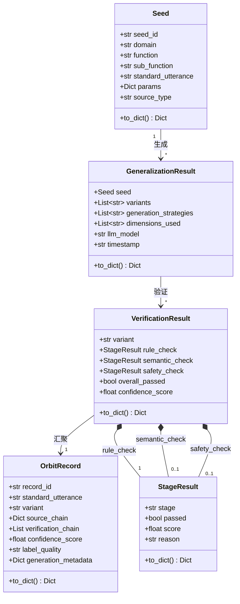

# Car-ORBIT-Agent — 接口设计文档

## 核心数据模型

本项目的数据模型围绕 ORBIT 流水线的三个阶段设计：种子（Seed）、泛化结果（GeneralizationResult）和验证结果（VerificationResult），最终汇聚为完整的输出记录（OrbitRecord）。



## 公共接口规范

### SeedEngine

SeedEngine 是种子生成引擎，负责从功能树配置或 Excel 文件中系统化生成功能种子。它是 ORBIT 流水线的起点。

| 方法 | 签名 | 说明 |
|------|------|------|
| `generate_from_config` | `(config_path: str, max_seeds: int = 1000) -> List[Seed]` | 从 YAML/JSON 功能树配置生成种子 |
| `extract_from_excel` | `(excel_path: str, domain_col: str, function_col: str, utterance_col: str) -> List[Seed]` | 从 Excel 文件提取种子 |

### GeneralizationEngine

GeneralizationEngine 是多维度泛化引擎，对种子沿五个维度（口语化、句式、参数变化、简化、场景）生成话术变体。

| 方法 | 签名 | 说明 |
|------|------|------|
| `generalize` | `(seed: Seed, num_variants: int = 5, dimensions: List[str] = None) -> GeneralizationResult` | 对单个种子执行多维度泛化 |
| `generalize_batch` | `(seeds: List[Seed], num_variants: int = 5, dimensions: List[str] = None) -> List[GeneralizationResult]` | 批量泛化 |

### CascadeOrchestrator

CascadeOrchestrator 是级联验证编排器，依次执行规则验证、语义验证和安全验证，采用短路策略。

| 方法 | 签名 | 说明 |
|------|------|------|
| `verify` | `(variant: str, seed: Seed) -> VerificationResult` | 对单个变体执行级联验证 |
| `verify_batch` | `(variants: List[str], seed: Seed) -> List[VerificationResult]` | 批量级联验证 |

### RuleVerifier / SemanticVerifier / SafetyVerifier

三个验证器共享统一的接口签名，返回 StageResult。

| 方法 | 签名 | 说明 |
|------|------|------|
| `verify` | `(variant: str, seed: Seed) -> StageResult` | 对单个变体执行验证 |
| `verify_batch` | `(variants: List[str], seed: Seed) -> List[StageResult]` | 批量验证 |

### LLMClient

LLMClient 封装 OpenAI 兼容 API 调用，提供统一的重试和回退能力。

| 方法 | 签名 | 说明 |
|------|------|------|
| `chat` | `(messages: List[Dict], model: str = None, temperature: float = 0.8) -> str` | 发送聊天请求，返回文本 |
| `chat_json` | `(messages: List[Dict], model: str = None, temperature: float = 0.3) -> Dict` | 发送聊天请求，返回 JSON |

### ProvenanceTracker

ProvenanceTracker 记录来源链和验证链，持久化为 JSONL 轨迹文件。

| 方法 | 签名 | 说明 |
|------|------|------|
| `record_seed` | `(seed: Seed) -> None` | 记录种子生成事件 |
| `record_generalization` | `(seed: Seed, variants: List[str], metadata: Dict) -> None` | 记录泛化事件 |
| `record_verification` | `(seed: Seed, variant: str, result: Dict) -> None` | 记录验证事件 |
| `build_record` | `(seed, variant, gen_metadata, ver_result) -> OrbitRecord` | 构建最终输出记录 |
| `save` | `(output_path: str) -> None` | 保存记录到 JSON |
| `get_statistics` | `() -> Dict` | 获取统计信息 |

### OrbitDatasetAdapter

OrbitDatasetAdapter 将流水线输出转换为多种格式。

| 方法 | 签名 | 说明 |
|------|------|------|
| `to_json` | `(records: List[OrbitRecord], output_path: str) -> str` | 导出为 JSON |
| `to_jsonl` | `(records: List[OrbitRecord], output_path: str) -> str` | 导出为 JSONL |
| `to_excel` | `(records: List[OrbitRecord], output_path: str) -> str` | 导出为 Excel |
| `generate_summary` | `(records: List[OrbitRecord]) -> Dict` | 生成统计摘要 |

## 工具层接口（Hermes 集成）

工具层为 Hermes Agent 提供可调用的工具函数。每个工具函数接收 `params: Dict` 参数，返回 `Dict` 结果。

| 工具名称 | handler 函数 | 说明 |
|----------|-------------|------|
| `orbit_seed_generate` | `handle_orbit_seed_generate(params)` | 种子生成 |
| `orbit_generalize` | `handle_orbit_generalize(params)` | 单条泛化 |
| `orbit_batch_generalize` | `handle_orbit_batch_generalize(params)` | 批量泛化 |
| `orbit_verify` | `handle_orbit_verify(params)` | 单条验证 |
| `orbit_batch_verify` | `handle_orbit_batch_verify(params)` | 批量验证 |

## 错误处理规范

所有公共接口遵循统一的错误处理策略。业务逻辑错误（如无效的维度名称、缺少必要列）抛出 `ValueError`，并在异常消息中包含具体的错误原因和修复建议。文件系统错误（如文件不存在）抛出 `FileNotFoundError`。LLM API 调用错误由 `LLMClient` 内部处理（重试 + 回退），重试耗尽后抛出 `RuntimeError`。工具层 handler 函数捕获所有异常并返回包含 `error` 字段的字典，不向上传播异常。

## 代码框架文件清单

| 文件路径 | 状态 | 说明 |
|----------|------|------|
| `core/__init__.py` | 已创建 | 核心引擎层包入口 |
| `core/config_loader.py` | 已创建 | 配置加载器框架 |
| `core/seed_engine.py` | 已创建 | 种子引擎框架 |
| `core/generalization_engine.py` | 已创建 | 泛化引擎框架 |
| `core/llm_client.py` | 已创建 | LLM 客户端框架 |
| `core/rule_verifier.py` | 已创建 | 规则验证器框架 |
| `core/semantic_verifier.py` | 已创建 | 语义验证器框架 |
| `core/safety_verifier.py` | 已创建 | 安全验证器框架 |
| `core/cascade_orchestrator.py` | 已创建 | 级联编排器框架 |
| `core/provenance_tracker.py` | 已创建 | 来源链追踪器框架 |
| `tools/orbit_seed_tool.py` | 已创建 | 种子工具框架 |
| `tools/orbit_generalize_tool.py` | 已创建 | 泛化工具框架 |
| `tools/orbit_verify_tool.py` | 已创建 | 验证工具框架 |
| `tools/orbit_toolset_adapter.py` | 已创建 | 工具集适配器 |
| `scripts/orbit_dataset_adapter.py` | 已创建 | 数据集适配器框架 |
| `skills/car-orbit-synthesis/SKILL.md` | 已创建 | 技能定义文件 |
| `configs/orbit_vehicle_tree_sample.yaml` | 已创建 | 示例功能树配置 |


---

# VLM-Data-Agent 接口与数据结构定义（Phase 3 扩展）

> Phase 3 产出 — 定义 VLM 视觉链路的代码级契约、模块接口和数据流。

## 设计原则

本接口设计遵循以下原则，与 ARCHITECTURE.md 中的架构决策保持一致：

| 原则 | 说明 |
|------|------|
| **契约优先** | 所有模块间交互通过 `core/contracts.py` 中的数据类定义，不依赖裸字典 |
| **与 ORBIT 对齐** | VLM 链路复用 ORBIT 的 `StageResult`、`LLMClient`、`ConfigLoader` 等基础设施 |
| **渐进式验证** | 三层验证（结构 → 文本自洽 → 视觉一致性）采用短路策略，前层失败不进入后层 |
| **双轨导出** | 训练导出（JSONL）和审阅导出（Excel）分离，满足不同消费场景 |

## VLM 核心数据契约 (`core/contracts.py`)

### 枚举类型

```python
class LabelQuality(Enum):
    VERIFIED = "synthetic_verified"
    REJECTED = "synthetic_rejected"
    PENDING  = "pending"

class QuestionType(Enum):
    DESCRIPTIVE    = "descriptive"
    COUNTING       = "counting"
    SPATIAL        = "spatial"
    YES_NO         = "yes_no"
    IDENTIFICATION = "identification"
    REASONING      = "reasoning"
    COMPARATIVE    = "comparative"
```

### VisualSeed — 视觉任务种子

VisualSeed 是 VLM 链路的输入原子单位，由 `VisualSeedEngine` 从配置文件组合生成。

| 字段 | 类型 | 说明 |
|------|------|------|
| `seed_id` | `str` | 自动生成，格式 `vseed_{uuid8}` |
| `task_category` | `str` | 任务类别（如 `scene_understanding`） |
| `scene_description` | `str` | 场景自然语言描述 |
| `entities` | `List[str]` | 场景中的实体列表 |
| `question_type` | `str` | 问题类型（对应 `QuestionType` 枚举） |
| `answer_style` | `str` | 回答风格（`brief` / `detailed`） |
| `image_style` | `str` | 图像风格（`photorealistic` / `illustration`） |
| `constraints` | `Dict` | 约束条件 |
| `metadata` | `Dict` | 扩展元数据 |

### VLMSample — 候选样本

VLMSample 是泛化引擎输出的中间产物，贯穿图像合成和三层验证阶段。

| 字段 | 类型 | 说明 |
|------|------|------|
| `sample_id` | `str` | 自动生成，格式 `vsample_{uuid8}` |
| `seed_id` | `str` | 关联的种子 ID |
| `question` | `str` | 生成的视觉问题 |
| `answer` | `str` | 对应的标准答案 |
| `image_prompt` | `str` | 图像生成提示词 |
| `statement` | `str` | 语义陈述（用于一致性校验） |
| `image_path` | `str` | 生成的图像文件路径 |
| `status` | `str` | 状态流转：`pending` → `image_generated` → `verified` / `rejected` / `failed` |
| `failure_reason` | `str` | 失败原因 |
| `verification_results` | `List[Dict]` | 各层验证结果 |

关键属性：`is_verified` 返回 `status == "verified"`；`has_image` 返回 `image_path` 非空。

### VLMRecord — 最终记录

VLMRecord 是通过全部验证的样本映射而来的最终输出记录，直接用于训练导出。

| 字段 | 类型 | 说明 |
|------|------|------|
| `record_id` | `str` | 格式 `vlm_{uuid8}` |
| `run_id` | `str` | 运行批次标识 |
| `messages` | `List[Dict]` | OpenAI 格式对话（user + assistant） |
| `images` | `List[str]` | 关联图像路径列表 |
| `label_quality` | `str` | 标签质量（`LabelQuality` 枚举值） |
| `confidence_score` | `float` | 综合置信度 |
| `source_chain` | `Dict` | 来源链（种子信息） |
| `verification_chain` | `List[Dict]` | 验证链（各层结果） |
| `review_fields` | `Dict` | 审阅专用字段 |

工厂方法 `VLMRecord.from_sample(sample, seed, run_id, confidence_score)` 负责从 VLMSample 和 VisualSeed 构建最终记录。

## VLM 模型客户端接口

### ImageClient (`core/image_client.py`)

图像生成客户端，封装 DALL-E / Stable Diffusion 等图像生成 API。

| 方法 | 签名 | 说明 |
|------|------|------|
| `generate` | `(prompt: str, output_path: str) -> ImageResult` | 生成单张图像 |
| `generate_batch` | `(prompts: List[str], output_dir: str) -> List[ImageResult]` | 批量生成图像 |

`ImageResult` 数据类包含 `success`、`image_path`、`model`、`prompt`、`error` 字段。

### VLMClient (`core/vlm_client.py`)

视觉语言模型客户端，封装多模态 API 调用。

| 方法 | 签名 | 说明 |
|------|------|------|
| `judge` | `(image_path, question, expected_answer, threshold) -> VLMJudgment` | 判断图像与 QA 对的一致性 |
| `judge_consistency` | `(image_path, statement, threshold) -> VLMJudgment` | 判断图像与语义陈述的一致性 |
| `describe` | `(image_path) -> str` | 生成图像描述 |

`VLMJudgment` 数据类包含 `passed`、`score`、`reason`、`model` 字段。

### ClientFactory (`core/client_factory.py`)

统一客户端工厂，根据配置创建各类客户端实例。

| 方法 | 签名 | 说明 |
|------|------|------|
| `create_llm` | `(config_loader) -> LLMClient` | 创建 LLM 客户端 |
| `create_image` | `(config_loader) -> ImageClient` | 创建图像生成客户端 |
| `create_vlm` | `(config_loader) -> VLMClient` | 创建 VLM 客户端 |
| `create_all` | `(config_loader) -> Dict[str, Any]` | 创建所有客户端 |

## VLM 引擎接口

### VisualSeedEngine (`core/visual_seed_engine.py`)

视觉任务种子引擎，从 YAML 配置文件组合生成 `VisualSeed` 对象。

| 方法 | 签名 | 说明 |
|------|------|------|
| `generate_from_config` | `(config_path: str, max_seeds: int = 100) -> List[VisualSeed]` | 从配置文件组合生成种子 |
| `generate_single` | `(task_category, scene, question_type, ...) -> VisualSeed` | 生成单个种子 |

配置文件格式参见 `configs/vlm_task_sample.yaml`。

### VisualGeneralizationEngine (`core/visual_generalization_engine.py`)

视觉泛化引擎，基于 VisualSeed 调用 LLM 生成多组 VLMSample。

| 方法 | 签名 | 说明 |
|------|------|------|
| `generate` | `(seed: VisualSeed, count: int = 1) -> List[VLMSample]` | 对单个种子生成候选样本 |
| `generate_batch` | `(seeds: List[VisualSeed], count: int = 1) -> List[VLMSample]` | 批量生成 |

LLM 输出 JSON 格式：`{question, answer, image_prompt, statement}`。

### ImageSynthesisCoordinator (`core/image_synthesis_coordinator.py`)

图像合成协调器，调用 ImageClient 为 VLMSample 生成图像。

| 方法 | 签名 | 说明 |
|------|------|------|
| `synthesize` | `(sample: VLMSample, output_dir: str) -> VLMSample` | 为单个样本生成图像 |
| `synthesize_batch` | `(samples: List[VLMSample], output_dir: str) -> List[VLMSample]` | 批量图像合成 |

成功后将 `sample.image_path` 设置为生成的图像路径，`sample.status` 更新为 `image_generated`。

## VLM 验证器接口

三层验证器均返回 `StageResult`（复用 ORBIT 的 `core/rule_verifier.py` 中的定义）。

### SchemaVerifier (`core/schema_verifier.py`)

结构校验器，验证 VLMSample 的必填字段和格式约束。校验规则包括：`question` 非空且以问号结尾、`answer` 非空、`image_prompt` 非空且为英文、`statement` 非空。

| 方法 | 签名 | 说明 |
|------|------|------|
| `verify` | `(sample: VLMSample) -> StageResult` | 单样本结构校验 |
| `verify_batch` | `(samples: List[VLMSample]) -> List[StageResult]` | 批量结构校验 |

### ConsistencyVerifier (`core/consistency_verifier.py`)

文本自洽校验器，调用 LLM 判断 question / answer / statement 三者的语义一致性。

| 方法 | 签名 | 说明 |
|------|------|------|
| `verify` | `(sample: VLMSample, threshold: float = 0.7) -> StageResult` | 单样本文本自洽校验 |
| `verify_batch` | `(samples: List[VLMSample], threshold: float = 0.7) -> List[StageResult]` | 批量校验 |

### VisionConsistencyVerifier (`core/vision_consistency_verifier.py`)

图像内容一致性校验器，调用 VLMClient 判断图像与文本的一致性。综合评分策略为 QA 一致性权重 60%，陈述一致性权重 40%。

| 方法 | 签名 | 说明 |
|------|------|------|
| `verify` | `(sample: VLMSample, threshold: float = None) -> StageResult` | 单样本视觉一致性校验 |
| `verify_batch` | `(samples: List[VLMSample], threshold: float = None) -> List[StageResult]` | 批量校验 |

## VLM 管线编排接口

### VLMPipelineRunner (`core/vlm_pipeline_runner.py`)

VLM 管线编排器，串联完整流程：文本泛化 → 图像合成 → 三层验证 → 记录映射。

| 方法 | 签名 | 说明 |
|------|------|------|
| `run_single` | `(seed, output_dir, run_id, samples_per_seed) -> PipelineResult` | 单种子完整管线 |
| `run_batch` | `(seeds, output_dir, run_id, samples_per_seed) -> BatchPipelineResult` | 批量管线 |

`PipelineResult` 包含 `seed_id`、`samples`、`records`、`total_generated`、`total_verified`、`total_rejected`、`total_failed`、`elapsed_ms`、`errors`。

`BatchPipelineResult` 聚合多个 `PipelineResult`，提供批次级统计。

## VLM 导出接口

### VLMDatasetAdapter (`scripts/vlm_dataset_adapter.py`)

训练导出与审阅导出的双轨结构。

| 方法 | 签名 | 说明 |
|------|------|------|
| `export_training` | `(records: List[VLMRecord], output_path: str) -> ExportSummary` | 导出训练数据（JSONL） |
| `export_review` | `(records: List[VLMRecord], output_path: str) -> ExportSummary` | 导出审阅报告（Excel） |
| `export_all` | `(records, output_dir, run_id) -> Dict[str, ExportSummary]` | 同时导出两种格式 |

训练导出仅包含 `label_quality == "synthetic_verified"` 的记录，兼容 OpenAI fine-tuning 格式。审阅导出包含所有记录，附带提示词、失败原因、模型版本等审阅专用字段。

## VLM CLI 接口

### `vlm` 子命令

```bash
python scripts/cli.py vlm \
    --config configs/vlm_task_sample.yaml \
    --output-dir output/vlm \
    --samples 3 \
    --max-seeds 50 \
    --model gpt-4.1-mini \
    --image-model dall-e-3 \
    --threshold 0.7 \
    --verbose
```

| 参数 | 默认值 | 说明 |
|------|--------|------|
| `--config, -c` | （必填） | VLM 任务配置文件 |
| `--output-dir, -o` | `output/vlm` | 输出目录 |
| `--samples, -n` | `1` | 每个种子生成的样本数 |
| `--max-seeds` | `100` | 最大种子数量 |
| `--model, -m` | `gpt-4.1-mini` | 文本生成模型 |
| `--image-model` | `dall-e-3` | 图像生成模型 |
| `--skip-image` | `false` | 跳过图像生成 |
| `--skip-vision-verify` | `false` | 跳过视觉一致性校验 |
| `--threshold, -t` | `0.7` | 验证通过阈值 |
| `--verbose, -v` | `false` | 详细日志 |

## VLM 配置命名空间

VLM 配置段已添加到 `ConfigLoader` 的默认配置中，通过 `get_vlm_config()` 获取：

```yaml
vlm:
  model:
    generation: gpt-4.1-mini
    image_generation: dall-e-3
    vision_verification: gpt-4.1-mini
    consistency_verification: gpt-4.1-mini
  image:
    default_size: 1024x1024
    default_quality: standard
  verification:
    schema_enabled: true
    consistency_threshold: 0.7
    vision_threshold: 0.7
    qa_weight: 0.6
    statement_weight: 0.4
  pipeline:
    samples_per_seed: 1
    max_seeds: 100
    batch_size: 5
  processing:
    max_retries: 3
    retry_delay: 2.0
    timeout: 120.0
```

## VLM 数据流总览

```
VisualSeedEngine                    VisualGeneralizationEngine
  ┌──────────┐                        ┌──────────────────┐
  │ YAML配置  │──→ List[VisualSeed] ──→│ LLM 文本泛化     │──→ List[VLMSample]
  └──────────┘                        └──────────────────┘
                                              │
                                              ▼
                                    ImageSynthesisCoordinator
                                      ┌──────────────────┐
                                      │ 图像生成 API      │──→ VLMSample.image_path
                                      └──────────────────┘
                                              │
                                              ▼
                              ┌─────────────────────────────────┐
                              │ 三层验证（短路策略）               │
                              │  1. SchemaVerifier               │
                              │  2. ConsistencyVerifier          │
                              │  3. VisionConsistencyVerifier    │
                              └─────────────────────────────────┘
                                              │
                                              ▼
                                    VLMRecord.from_sample()
                                      ┌──────────────────┐
                                      │ 记录映射          │──→ List[VLMRecord]
                                      └──────────────────┘
                                              │
                                              ▼
                                    VLMDatasetAdapter
                                      ┌──────────────────┐
                                      │ 训练导出 (JSONL)   │
                                      │ 审阅导出 (Excel)   │
                                      └──────────────────┘
```

## VLM 新增文件清单

| 文件路径 | 状态 | 说明 |
|----------|------|------|
| `core/contracts.py` | 已创建 | VLM 核心数据契约（VisualSeed、VLMSample、VLMRecord） |
| `core/image_client.py` | 已创建 | 图像生成客户端 |
| `core/vlm_client.py` | 已创建 | 视觉语言模型客户端 |
| `core/client_factory.py` | 已创建 | 统一客户端工厂 |
| `core/visual_seed_engine.py` | 已创建 | 视觉种子引擎 |
| `core/visual_generalization_engine.py` | 已创建 | 视觉泛化引擎 |
| `core/image_synthesis_coordinator.py` | 已创建 | 图像合成协调器 |
| `core/schema_verifier.py` | 已创建 | 结构校验器 |
| `core/consistency_verifier.py` | 已创建 | 文本自洽校验器 |
| `core/vision_consistency_verifier.py` | 已创建 | 图像内容一致性校验器 |
| `core/vlm_pipeline_runner.py` | 已创建 | VLM 管线编排器 |
| `scripts/vlm_dataset_adapter.py` | 已创建 | VLM 双轨导出适配器 |
| `configs/vlm_task_sample.yaml` | 已创建 | VLM 任务配置示例 |

## VLM 修改文件清单

| 文件路径 | 修改内容 |
|----------|----------|
| `core/__init__.py` | 导出 VLM 新增模块的所有公共类 |
| `core/config_loader.py` | 添加 `vlm` 配置命名空间和 `get_vlm_config()` 方法 |
| `scripts/cli.py` | 添加 `vlm` 子命令，版本升至 0.3.0 |
