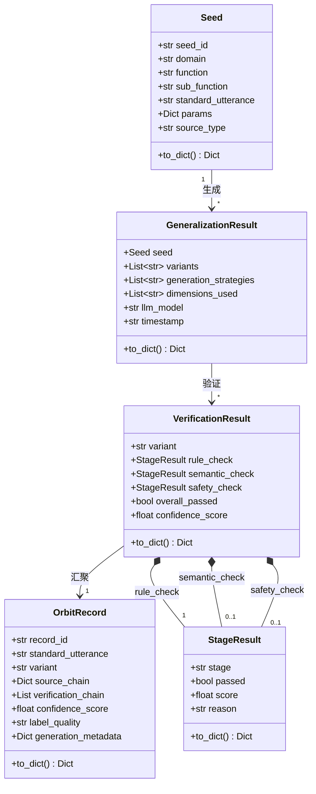

# Car-ORBIT-Agent — 接口设计文档

## 核心数据模型

本项目的数据模型围绕 ORBIT 流水线的三个阶段设计：种子（Seed）、泛化结果（GeneralizationResult）和验证结果（VerificationResult），最终汇聚为完整的输出记录（OrbitRecord）。

## 公共接口规范

### SeedEngine

SeedEngine 是种子生成引擎，负责从功能树配置或 Excel 文件中系统化生成功能种子。它是 ORBIT 流水线的起点。

| 方法 | 签名 | 说明 |
|------|------|------|
| `generate_from_config` | `(config_path: str, max_seeds: int = 1000) -> List[Seed]` | 从 YAML/JSON 功能树配置生成种子 |
| `extract_from_excel` | `(excel_path: str, domain_col: str, function_col: str, utterance_col: str) -> List[Seed]` | 从 Excel 文件提取种子 |

### GeneralizationEngine

GeneralizationEngine 是多维度泛化引擎，对种子沿五个维度（口语化、句式、参数变化、简化、场景）生成话术变体。

| 方法 | 签名 | 说明 |
|------|------|------|
| `generalize` | `(seed: Seed, num_variants: int = 5, dimensions: List[str] = None) -> GeneralizationResult` | 对单个种子执行多维度泛化 |
| `generalize_batch` | `(seeds: List[Seed], num_variants: int = 5, dimensions: List[str] = None) -> List[GeneralizationResult]` | 批量泛化 |

### CascadeOrchestrator

CascadeOrchestrator 是级联验证编排器，依次执行规则验证、语义验证和安全验证，采用短路策略。

| 方法 | 签名 | 说明 |
|------|------|------|
| `verify` | `(variant: str, seed: Seed) -> VerificationResult` | 对单个变体执行级联验证 |
| `verify_batch` | `(variants: List[str], seed: Seed) -> List[VerificationResult]` | 批量级联验证 |

### RuleVerifier / SemanticVerifier / SafetyVerifier

三个验证器共享统一的接口签名，返回 StageResult。

| 方法 | 签名 | 说明 |
|------|------|------|
| `verify` | `(variant: str, seed: Seed) -> StageResult` | 对单个变体执行验证 |
| `verify_batch` | `(variants: List[str], seed: Seed) -> List[StageResult]` | 批量验证 |

### LLMClient

LLMClient 封装 OpenAI 兼容 API 调用，提供统一的重试和回退能力。

| 方法 | 签名 | 说明 |
|------|------|------|
| `chat` | `(messages: List[Dict], model: str = None, temperature: float = 0.8) -> str` | 发送聊天请求，返回文本 |
| `chat_json` | `(messages: List[Dict], model: str = None, temperature: float = 0.3) -> Dict` | 发送聊天请求，返回 JSON |

### ProvenanceTracker

ProvenanceTracker 记录来源链和验证链，持久化为 JSONL 轨迹文件。

| 方法 | 签名 | 说明 |
|------|------|------|
| `record_seed` | `(seed: Seed) -> None` | 记录种子生成事件 |
| `record_generalization` | `(seed: Seed, variants: List[str], metadata: Dict) -> None` | 记录泛化事件 |
| `record_verification` | `(seed: Seed, variant: str, result: Dict) -> None` | 记录验证事件 |
| `build_record` | `(seed, variant, gen_metadata, ver_result) -> OrbitRecord` | 构建最终输出记录 |
| `save` | `(output_path: str) -> None` | 保存记录到 JSON |
| `get_statistics` | `() -> Dict` | 获取统计信息 |

### OrbitDatasetAdapter

OrbitDatasetAdapter 将流水线输出转换为多种格式。

| 方法 | 签名 | 说明 |
|------|------|------|
| `to_json` | `(records: List[OrbitRecord], output_path: str) -> str` | 导出为 JSON |
| `to_jsonl` | `(records: List[OrbitRecord], output_path: str) -> str` | 导出为 JSONL |
| `to_excel` | `(records: List[OrbitRecord], output_path: str) -> str` | 导出为 Excel |
| `generate_summary` | `(records: List[OrbitRecord]) -> Dict` | 生成统计摘要 |

## 工具层接口（Hermes 集成）

工具层为 Hermes Agent 提供可调用的工具函数。每个工具函数接收 `params: Dict` 参数，返回 `Dict` 结果。

| 工具名称 | handler 函数 | 说明 |
|----------|-------------|------|
| `orbit_seed_generate` | `handle_orbit_seed_generate(params)` | 种子生成 |
| `orbit_generalize` | `handle_orbit_generalize(params)` | 单条泛化 |
| `orbit_batch_generalize` | `handle_orbit_batch_generalize(params)` | 批量泛化 |
| `orbit_verify` | `handle_orbit_verify(params)` | 单条验证 |
| `orbit_batch_verify` | `handle_orbit_batch_verify(params)` | 批量验证 |

## 错误处理规范

所有公共接口遵循统一的错误处理策略。业务逻辑错误（如无效的维度名称、缺少必要列）抛出 `ValueError`，并在异常消息中包含具体的错误原因和修复建议。文件系统错误（如文件不存在）抛出 `FileNotFoundError`。LLM API 调用错误由 `LLMClient` 内部处理（重试 + 回退），重试耗尽后抛出 `RuntimeError`。工具层 handler 函数捕获所有异常并返回包含 `error` 字段的字典，不向上传播异常。

## 代码框架文件清单

| 文件路径 | 状态 | 说明 |
|----------|------|------|
| `core/__init__.py` | 已创建 | 核心引擎层包入口 |
| `core/config_loader.py` | 已创建 | 配置加载器框架 |
| `core/seed_engine.py` | 已创建 | 种子引擎框架 |
| `core/generalization_engine.py` | 已创建 | 泛化引擎框架 |
| `core/llm_client.py` | 已创建 | LLM 客户端框架 |
| `core/rule_verifier.py` | 已创建 | 规则验证器框架 |
| `core/semantic_verifier.py` | 已创建 | 语义验证器框架 |
| `core/safety_verifier.py` | 已创建 | 安全验证器框架 |
| `core/cascade_orchestrator.py` | 已创建 | 级联编排器框架 |
| `core/provenance_tracker.py` | 已创建 | 来源链追踪器框架 |
| `tools/orbit_seed_tool.py` | 已创建 | 种子工具框架 |
| `tools/orbit_generalize_tool.py` | 已创建 | 泛化工具框架 |
| `tools/orbit_verify_tool.py` | 已创建 | 验证工具框架 |
| `tools/orbit_toolset_adapter.py` | 已创建 | 工具集适配器 |
| `scripts/orbit_dataset_adapter.py` | 已创建 | 数据集适配器框架 |
| `skills/car-orbit-synthesis/SKILL.md` | 已创建 | 技能定义文件 |
| `configs/orbit_vehicle_tree_sample.yaml` | 已创建 | 示例功能树配置 |
